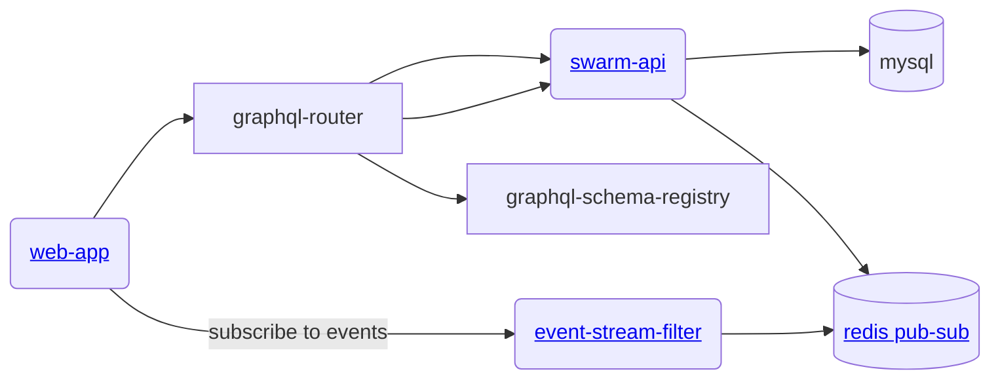

# gratheon / swarm-api
Main monolith service to manage beehive data.


## Architecture



## Database migrations
We use goose to manage database migrations.
To 
```bash
just migrate-db-dev
```


## Development
Based on [gqlgen](https://gqlgen.com/getting-started/).

```
cp config/config.example.json config/config.dev.json
just start
```

To re-generate graphql -> go resolvers, run: 
```
just gen
```

## Testing

### Test Organization

Tests are organized by type using file suffixes:
- `*_unit_test.go` - Unit tests that don't require external dependencies
- `*_integration_test.go` - Integration tests that require database/external services
- `*_e2e_test.go` - End-to-end tests

### Test Structure Guidelines

- Tests use human-readable names that clearly describe what is being tested
- Tests use `t.Run()` nesting to organize test cases and scenarios
- Each test includes `// ARRANGE`, `// ACT`, and `// ASSERT` comments for clarity
- Integration tests use `t.Parallel()` to run concurrently where possible
- Assertions use `github.com/stretchr/testify/assert` for type-safe, readable checks

### Running Tests

Run all tests:
```bash
cd graph && go test -v ./...
```

Run specific test type:
```bash
cd graph && go test -v -run TestDataLoader
cd graph && go test -v -run TestSplitHive
```

Run tests for a specific function:
```bash
cd graph && go test -v -run "TestSplitHiveMutation/split_hive_with_new_queen"
```

### Prerequisites

Integration tests require a running MySQL database from the [mysql repo](https://github.com/Gratheon/mysql).

Start MySQL and run migrations:
```bash
cd ../mysql && just start
cd ../swarm-api && just migrate-db-dev
```

Configure database connection (optional):
```bash
export TEST_DB_DSN="root:test@tcp(localhost:5100)/swarm-api?parseTime=true"
```

See [graph/TESTING.md](graph/TESTING.md) for detailed testing documentation.

## Building
```
just build
```

## License

This project is **dual-licensed**:

- **[AGPL v3](LICENSE-AGPL.md)** - For open source use:
    - ✅ You can use, modify, and distribute the software
    - ✅ Source code is freely available
    - ⚠️ If you modify and host a public instance, you must share your modifications
    - ⚠️ Any derivative work must also be licensed under AGPL v3

- **[Commercial License](LICENSE-COMMERCIAL.md)** - For enterprise customers who need:
    - 🏢 On-premise deployment without source disclosure
    - 🔧 Custom modifications without copyleft obligations
    - 🎨 White-label/rebranding rights
    - 📞 Priority support and SLA guarantees

### Contributing

If you'd like to contribute, please see our [Contributing Guide](CONTRIBUTING.md) and sign our Contributor License Agreement (CLA).

*   Please refer to the `CODEOWNERS` file for ownership details.
*   Follow standard GitHub flow: Fork the repository, create a feature branch, make changes, and submit a Pull Request.
