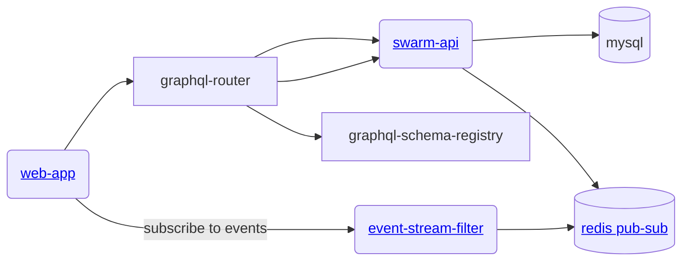

# gratheon / swarm-api
Main monolith service to manage beehive data.


## Architecture




## Development
Based on [gqlgen](https://gqlgen.com/getting-started/).

- re-run graphql schema -> code generator:
```
make gen
```

- start db
```
docker-compose up
``` 

- run server:
```
make run
```

## Building
```
make build
```

## Deployment
```
make deploy
```
