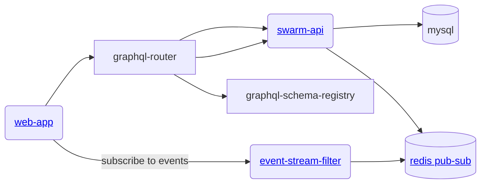

# gratheon / swarm-api
Main monolith service to manage beehive data.


## Architecture



## Database migrations
We use goose to manage database migrations.
To 
```bash
just migrate-db-dev
```


## Development
Based on [gqlgen](https://gqlgen.com/getting-started/).

```
cp config/config.example.json config/config.dev.json
just start
```

To re-generate graphql -> go resolvers, run: 
```
just gen
```

## Testing

Run e2e tests for split hive functionality:
```bash
just test
```

See [graph/TESTING.md](graph/TESTING.md) for detailed testing instructions.

## Building
```
just build
```

## License

This project is **dual-licensed**:

- **[AGPL v3](LICENSE-AGPL.md)** - For open source use:
    - ✅ You can use, modify, and distribute the software
    - ✅ Source code is freely available
    - ⚠️ If you modify and host a public instance, you must share your modifications
    - ⚠️ Any derivative work must also be licensed under AGPL v3

- **[Commercial License](LICENSE-COMMERCIAL.md)** - For enterprise customers who need:
    - 🏢 On-premise deployment without source disclosure
    - 🔧 Custom modifications without copyleft obligations
    - 🎨 White-label/rebranding rights
    - 📞 Priority support and SLA guarantees

### Contributing

If you'd like to contribute, please see our [Contributing Guide](CONTRIBUTING.md) and sign our Contributor License Agreement (CLA).

*   Please refer to the `CODEOWNERS` file for ownership details.
*   Follow standard GitHub flow: Fork the repository, create a feature branch, make changes, and submit a Pull Request.
